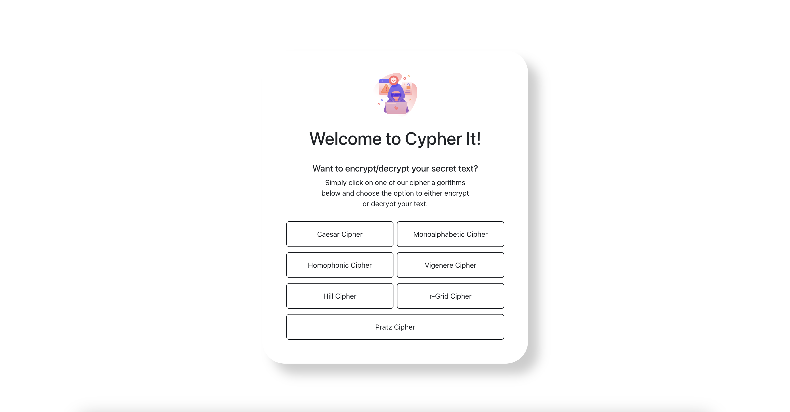

# Getting started with Cipher It! 🍾

## Hi! 👋 Welcome to Cipher It! 🔐
Cypher It! is a website where individuals can explore the encryption 
and decryption methods of seven types of ciphers. Namely, Caesar, Monoalphabetic, Homophonic, Vigenère, Hill, r-Grid, and, 
my personal invention, Pratz cipher. I hope you have fun cloning this repo and trying out the ciphers!



## Follow these instructions to get started 🙂

### NodeJS and NPM 💤
Start off by installing the latest stable versions of NodeJS and NPM. The following versions of NodeJS and NPM are recommended for effective usage of the application:
```
Node Version: v16.17.0
NPM Version: 8.15.0
```
Download Node from: https://nodejs.org/en/. Installing the correct Node version will also install the correct npm version. You can verify versions by running node -v and npm -v.

### Git 🌳
After installing these, download the latest version of git for application management.
Download git from: https://git-scm.com/downloads.

### Clone application from Github 👯‍♀️
With git installed, we can now clone the application codebase on our local machines.
Code repository link is provided below (repository is public). The project is named Ciphersecurity on GitHub and the alias name is Cypher It! Repository Link: https://github.com/praths7/Ciphersecurity.
Then, clone the application through the HTTPS method by running:
```
git clone https://github.com/praths7/Ciphersecurity.git
```
*Note*:

The application should now be cloned successfully. If there are any permission errors during cloning, please ensure your computer’s ssh public key is added to your profile on Github. The repository is publicly cloneable. No explicit permissions are needed for cloning.

*Aside*:

If you are getting any errors related to xcrun upon using the git clone command, run the following command to download command line tools for successful usage of git commands in terminal:
```
xcode-select –install
```
If the above does not run or work, run the following command instead:
```
sudo xcode-select –reset
```

### Installing frontend packages 🎨
After successful cloning, go into the frontend repository on your preferred terminal by running:
```
cd frontend
```
And then run:
```
npm install
```
To install all relevant frontend packages needed for the application. You should now be able to see the packages being installed in your local repository from your terminal. The downloading and installing should approximately take ~ 2 minutes.

### Installing python3 and pip3 🐍
Install python3 and pip3 to run the backend code and install python packages respectively. Please download the following recommended versions of python and pip:
```
Python: 3.10.7
Pip: pip 22.2.2
```

### Installing backend packages 🤓
Let’s now install the relevant backend packages by running the following three commands:
```
pip3 install python-dotenv
pip3 install flask
pip3 install flask_cors
pip3 install numpy
pip3 install pandas
pip3 install dataframe_image
```

### Running the Application 🏃‍♂️
We are now ready to run the application. Start off by opening two terminals. Navigate to the frontend folder in both terminals. In the first terminal run:
```
npm run start-backend
```
to start the backend. Then run the following command in the second terminal:
```
npm start
```
to start the frontend. You should now be able to see the frontend of the application after brief loading on your preferred browser.
